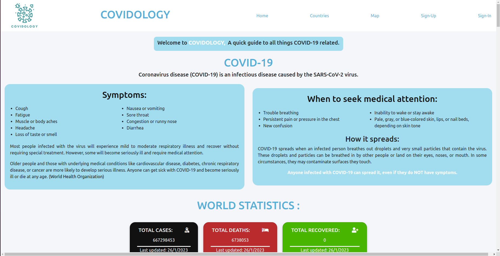
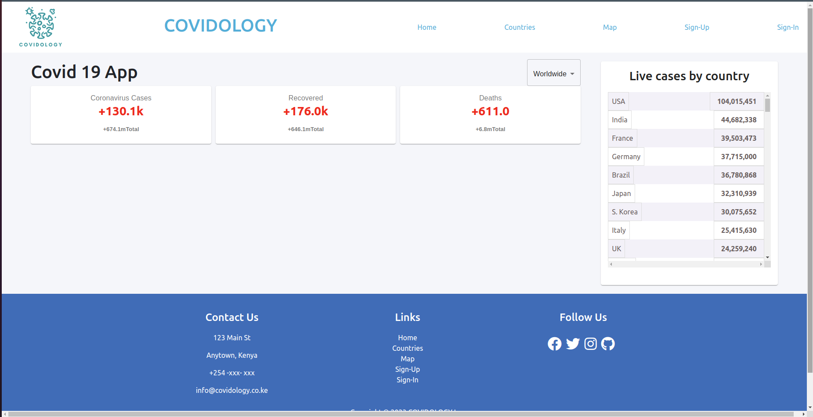
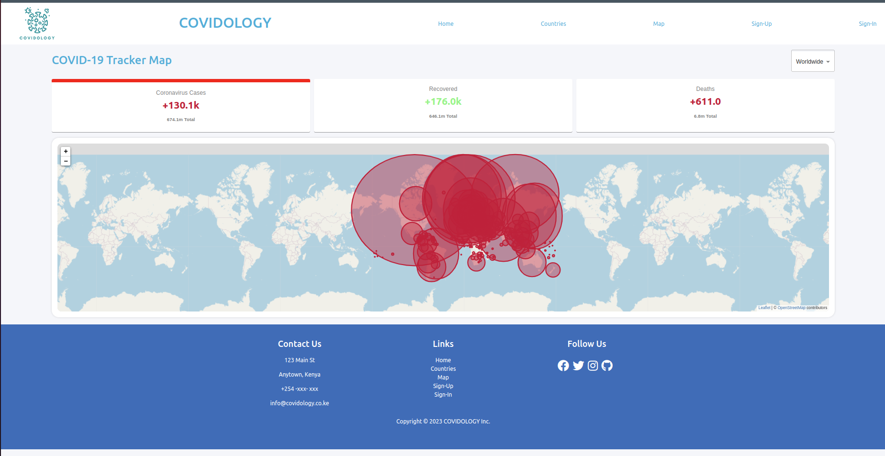
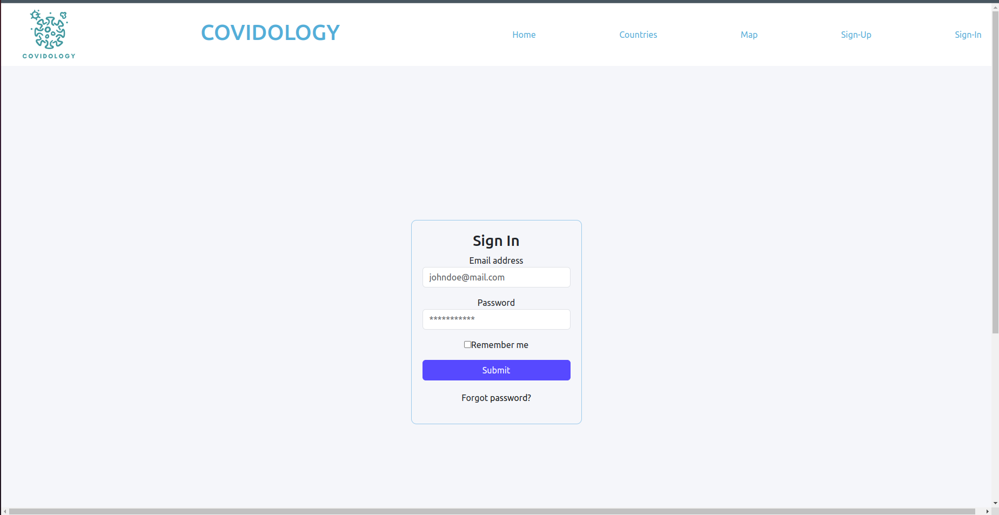
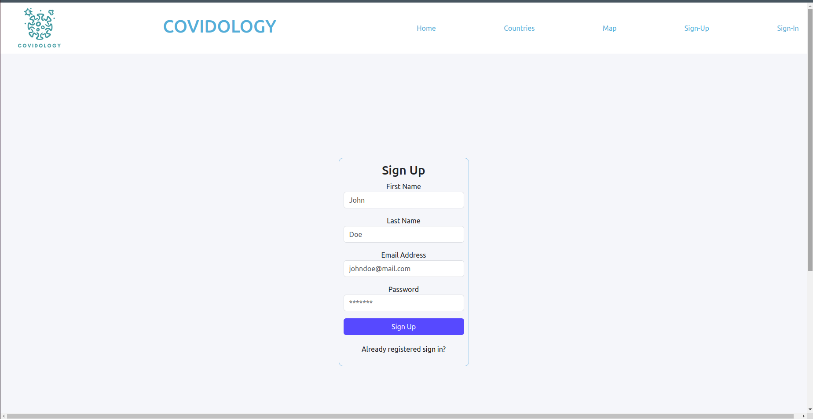

# COVIDOLOGY
==========================

## DESCRIPTION
**Covidology** is a COVID-19 tracker that provides data on global COVID-19 cases and deaths by country. It's main aim is to help people who are coping with the situation keep track of the spread of the virus around the world.

This project is the phase II capstone project at Moringa School of Technology. It's a compilation of the skills learnt through the software development course, in the second phase that covers the basics to React. It mainly puts focus on REACT.js for Front-end web programming, and has components of CSS and HTML.

```
https://github.com/jamnjeri/phase2-project
```

## REQUIREMENTS
### Prerequisites
* node v14.17.4 and above
* npm 6.14.14 and above
* Vue 2.6.11
* Then install the various packages from package.json `npm install`
* Create environment variables

### Additional Dependancies
* React Router version 6 `npm install react-router-dom@6`
* Axios  `npm install axios`
* Chart.js  `npm install chart.js`
* React chart.js  `npm install chart.js react-chartjs-2`
* Leaflet  `npm i leaflet@1.6.0`
* React Leaflet  `npm i react-leaflet@2.7.0`
* Material-UI  `npm i @material-ui/core@4.11.0`
* Numeral `npm i numeral`


#### PROJECT DELIVERABLES
The Covidology platform has a single user authentication mechanism for users accessing the site as surfers.

As a user , one should able to:
1. Register for & Login to the platform.
2. View a landing page with general information on COVID-19.
3. View a list of all countries affected by the pandemic.
4. View a summary of all countries' cases in tabular format.
5. Search for country specific data via a search interface.
6. Visualize metric by aid of graphs.


### PROJECT-SETUP-INSTRUCTIONS
1. [Clone the repo to your local machine](https://github.com/jamnjeri/phase2-project.git)
2. Install required dependancies for by running `npm i`.
3. Legacy dependencies may be installed by running `npm i -f`
4. Run the application using  `npm start` to start the development server.


### TECHNOLOGIES-Used
- HTML - Used as a template to hold the React components of the app via the root div. <br/>
- CSS -used to style the User Interface. <br/>
- JS - Java Script is used to make the website interactive. <br/>
- REACT.js - Front-end Library. <br/>
- ​Jest & Minitests - Testing Framework. <br/>
- Git- For Version control


### KNOWN - BUGS
The API used to fetch data contains a fetch limit so the table data on the first page may sometimes generate a data when that limit is exceeded.

There are no other known bugs, should you find any, please raise an issue or a pull request for evaluation.


### Support And Team Details
---
| No  |      Name      |                  Email                   |     Role        |
| :-: | :------------: | :--------------------------------------: | :-----------:   |
|  1  | Jamila Mathu   | jamila.mathu@student.moringaschool.com    | Home Page, Webpage template, Docs (Scrum Master)|
|  2  |  Violet Bosire |  violet.bosire@student.moringaschool.com |  Docs and Authentication Pages |
|  3  | Gregory Lubano | gregory.lubano@student.moringaschool.com | Country Page      |
|  4  | Isaac Atuti    | isaac.atuti@student.moringaschool.com    | Map Page |
---

### REFERENCES

## Status:
    maintained, and is currently in development

## Version:
    v0.1.0
    
## Usage

## License

[](https://opensource.org/licenses/MIT)
Copyright © 2023 COVIDOLOGY Inc.


## Website Sample Images












